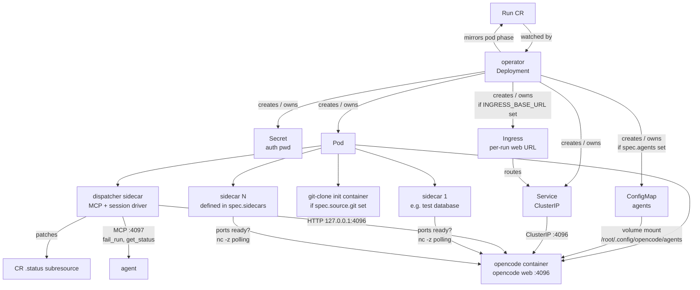
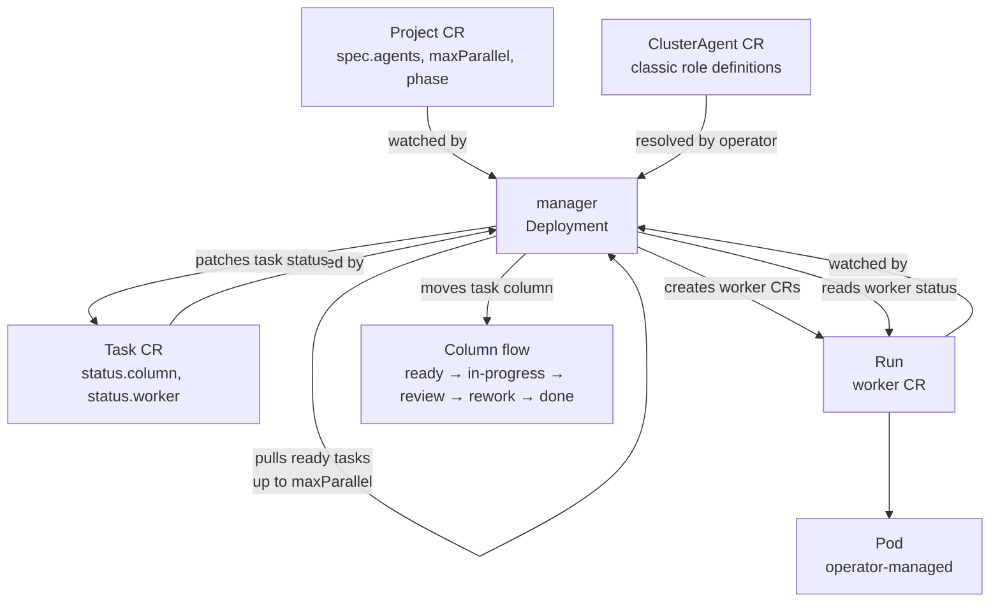
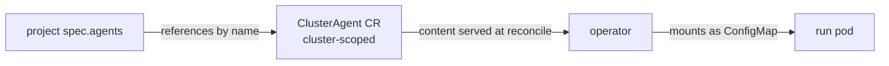
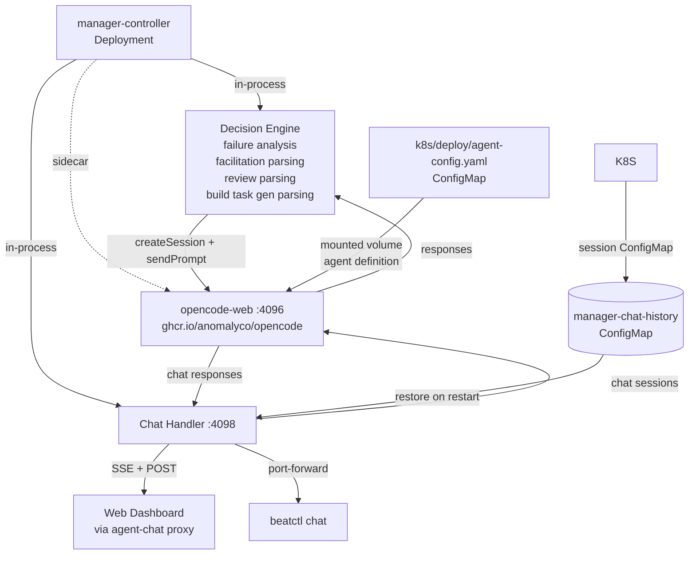
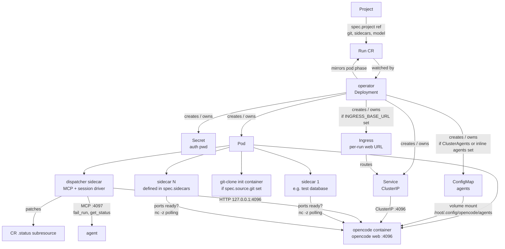
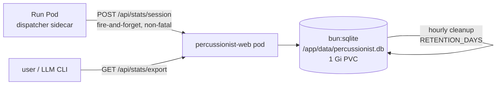
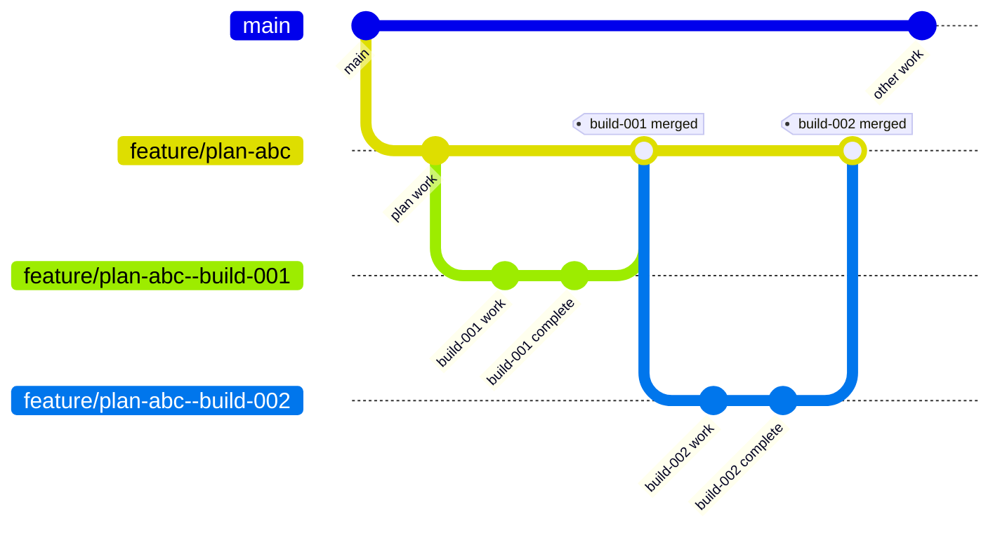

# percussionist

Kubernetes-native orchestration for [OpenCode](https://opencode.ai) agents.
Each agent run is a first-class Kubernetes resource — declarative, observable,
and scriptable from CI. Attach to a live run with `opencode attach` any time.

## Features

- **Declarative runs** — create an `Run` CR; the operator handles pod
  scheduling, auth secrets, service routing, and lifecycle mirroring.
- **Runner sidecars** — attach auxiliary containers (databases, proxies, etc.)
  to every run pod via `spec.sidecars[]`; opencode waits for declared TCP ports
  before starting work. Sidecar config cascades from project defaults to per-run
  overrides.
- **Dispatcher MCP** — the dispatcher sidecar exposes an MCP server on port 4097
  with tools (`fail_run`, `get_status`) so agents can signal failure or query
  their own run state without cluster API access.
- **Git workspaces** — clone any repo into `/workspace` before the agent starts,
  with branch/tag/SHA resolution and SSH key support.
- **Persistent caching** — project-scoped PVCs automatically cache package manager
  stores (pnpm, npm, bun) and build artifacts (Turbo) across all runs, dramatically
  reducing install time for monorepos and repeated builds.
- **Project boards** — each `Project` carries an embedded kanban-style
  board: parallel worker dispatch, automatic retries, human-in-the-loop review,
  and rework. The manager controller drives task execution from the board.
- **ClusterAgents** — cluster-scoped agent role definitions reusable across
  projects and runs; referenced by name rather than inlined per-run.
- **Web dashboard** — real-time run table, project/board views, agent catalog,
  and historical session analytics. Browser OS notifications and drum audio fire
  on run phase changes and board worker transitions; use `beatctl web` to serve
  the dashboard from `localhost` (a secure context) so these features work
  without HTTPS.
- **`beatctl` CLI** — submit, watch, attach, and cancel runs without touching
  `kubectl`.
- **Provider auth** — OAuth tokens (GitHub Copilot, ChatGPT Plus, Claude Pro)
  imported once and shared cluster-wide via Kubernetes Secrets.
- **Manager agent** — the manager controller embeds an OpenCode agent (opencode-web sidecar) with K8s tool access, a decision engine that diagnoses failures and parses ambiguous output, and an interactive chat API. Chat via the web dashboard or `beatctl chat`.

## Repo layout

```
.
├── k8s/                # All Kubernetes manifests
│   ├── crds/           # CustomResourceDefinitions (v1alpha1)
│   │   ├── opencoderun.yaml
│   │   ├── opencodeproject.yaml
│   │   └── clusteragent.yaml
│   ├── deploy/         # Kubernetes Deployment + RBAC manifests
│   │   ├── operator.yaml
│   │   ├── manager-controller.yaml
│   │   ├── agent-config.yaml  # opencode.json config + agent skill for manager decision engine
│   │   └── web.yaml
│   ├── agents/         # Production ClusterAgent definitions
│   ├── samples/        # Example manifests and smoke test
│   └── tests/          # E2E test manifests
├── images/
│   ├── api/            # Shared Zod schemas, constants, type helpers
│   ├── operator/       # CRD reconciler (informer + reconciler loop)
│   ├── dispatcher/     # Sidecar: session driver + MCP server (fail_run, get_status)
│   ├── cli/            # beatctl — user-facing CLI (includes `chat` command)
│   ├── web/            # Dashboard SPA + Hono server + bun:sqlite stats DB (includes agent-chat proxy)
│   └── manager-controller/  # Board controller + embedded agent module (decision engine, MCP tools, chat handler)
└── scripts/            # Cluster image loader + smoke test helpers
```

## Prerequisites

- `kubectl` pointed at a cluster you control (minikube, k3s, kind, or remote)
- `docker` to build images locally
- `pnpm` and Node 24 for the TypeScript workspace
- `opencode` CLI on your workstation (for `opencode attach`)
- At least one provider API key or OAuth token (see [Provider auth](#provider-auth))

## Getting started

### 1. Build and load all images

```sh
./scripts/minikube-load.sh
```

Builds `runner`, `operator`, `dispatcher`, `web`, and `manager` images and loads
them into minikube. For other cluster types:

| Cluster | How to make images available |
|---------|------------------------------|
| **minikube** | `./scripts/minikube-load.sh` (handles build + load) |
| **Docker Desktop** | Nothing — the daemon is shared |
| **k3s** | `docker save percussionist/runner:dev \| sudo k3s ctr images import -` |
| **kind** | `kind load docker-image percussionist/runner:dev` |
| **Remote** | Push to a registry; set `RUNNER_IMAGE_DEFAULT` on the operator Deployment |

When you change code and a pod is still pinning the old image, minikube's
plain `image load` silently no-ops. Pass `--force` to evict stale pods and
force a clean reload:

```sh
./scripts/minikube-load.sh --only dispatcher --force   # interactive
./scripts/minikube-load.sh --force --yes                # CI / scripts
```

`--force` does three things: rebuilds with `--no-cache`, evicts pods pinning
the old image ID, and runs `minikube image rm` before the fresh load.

### 2. Deploy CRDs + operator + web

```sh
beatctl deploy
```

Installs all three CRDs, the operator, manager controller, and web dashboard,
then waits for rollouts to complete. Equivalent manual flow:

```sh
kubectl apply -f k8s/crds/opencoderun.yaml
kubectl apply -f k8s/crds/opencodeproject.yaml
kubectl apply -f k8s/crds/clusteragent.yaml
kubectl apply -f k8s/deploy/operator.yaml
kubectl apply -f k8s/deploy/manager-controller.yaml
kubectl apply -f k8s/deploy/web.yaml
kubectl -n percussionist rollout status deploy/percussionist-operator
kubectl -n percussionist rollout status deploy/percussionist-manager
kubectl -n percussionist rollout status deploy/percussionist-web
```

To uninstall everything:

```sh
beatctl deploy --down
```

### 3. Submit a run

```sh
beatctl submit --task "say hello briefly" --project my-project --name hello
beatctl ls
# NAME   PHASE    SESSION                 TOK-IN  TOK-OUT  AGE
# hello  Running  ses_250c...              0       0        3s
beatctl logs hello -f
```

Typical lifecycle (elapsed ~5–10 s on a warm node):

```
NAME    PHASE            SESSION ID               TOKENS IN   TOKENS OUT
hello   Pending
hello   Running          ses_250d3c2afffe...              0           0
hello   Succeeded        ses_250d3c2afffe...             65          85

A run in `WaitingForInput` means the agent needs human clarification.
Reply from the dashboard or via `beatctl submit --attach`.
```

### 4. Attach to a live run

```sh
beatctl attach hello
```

Forwards the run's Service port, reads the auth Secret, and drops you into the
opencode TUI. Port-forward is torn down automatically on exit.

Or combine submit + attach in one step:

```sh
beatctl submit -i -a --name scratch --project my-project
# creates the run, waits for Running, then attaches
```

### 5. Tear down

```sh
beatctl cancel hello        # deletes the CR and all owned resources
beatctl deploy --down       # removes the operator, CRDs, and web dashboard
```

## Architecture

### Run



- **opencode container** runs `opencode web` on `:4096`. Network-isolated by
  default; exposed via per-run Ingress when configured.
- **dispatcher sidecar** waits for the runner's health endpoint, creates a
  session, fires `POST /session/:id/prompt_async`, then concurrently polls
  `/session/:id/message` and consumes the SSE `/event` stream for low-latency
  token updates. Once the last assistant message's `time.completed` is set it
  patches the CR to `Succeeded` (or `Failed` on error) and exits. A 1-hour
  hard timeout guard exits with code 3 if the run stalls indefinitely. The
  dispatcher also serves an MCP server on port 4097 exposing tools for agent use:
  - `complete_run(...)` — signal BUILD task completion (validates commit+push+PR)
  - `complete_plan(...)` — signal PLAN task completion (validates commit+push only)
  - `fail_run(reason)` — signal task failure, triggering facilitator analysis
  - `get_status()` — return current run state (phase, session ID, tokens)
- **sidecar containers** (`spec.sidecars[]`) are user-defined pods that start
  alongside opencode. The operator waits for all declared TCP ports on sidecars
  to become reachable before starting the agent. Up to 5 sidecars per run; config
  cascades from project-level defaults to per-run overrides.
- **operator** uses a hand-rolled informer (no kubebuilder for TypeScript),
  creates child objects with `ownerReferences` for cascading deletion, and
  mirrors Pod phase into the CR status. It fetches a fresh Run CR before each
  reconcile and coalesces events that arrive during processing into another pass.

### Project + Board



- **Projects** are the canonical home for environment config (git, secrets, model,
  image, resources). Every run and board worker inherits from its project.
- **Tasks** are first-class `Task` CRs with their own `spec` (title, type,
  description, agent, priority) and `status` (column, worker state). They are not
  embedded in the project spec — `spec.agents`, `spec.maxParallel`, and `spec.phase`
  are top-level project fields.
- **The manager controller** reconciles projects from Project, Task, and Run informer
  events plus periodic resync: pulls ready tasks up to `maxParallel`, monitors active
  workers from Run status, retries failed tasks (up to 3 retries), escalates when
  exhausted, and re-dispatches rework tasks with feedback context. Queue events that
  arrive while a project is already reconciling are coalesced into a follow-up reconcile.
- **Worker runs** are `Run` CRs created by the manager; they reference their
  parent project via `spec.project` for provenance and config resolution.

### ClusterAgent



`ClusterAgent` is a cluster-scoped resource that defines reusable agent role
definitions (system prompts + front-matter metadata). Projects reference agents
by name in `spec.agents[]`, and runs reference them via `spec.agent` or
`spec.agents`. The operator resolves names to content at reconcile time and
mounts them into the pod as a ConfigMap.

```yaml
apiVersion: percussionist.dev/v1alpha1
kind: ClusterAgent
metadata:
  name: code-reviewer
spec:
  content: |
    ---
    description: Reviews code for quality and security issues
    mode: subagent
    permission:
      edit: deny
      bash: deny
    ---

    You are a code reviewer. Focus on security, correctness, and maintainability.
```

CLI reference: `beatctl agent list`, `beatctl agent create --name <name> -f agent.yaml`

### Manager Agent

The manager controller embeds an LLM-powered agent that diagnoses board issues,
parses ambiguous facilitator output, and supports interactive chat. It runs as
a module inside the manager process alongside an opencode-web sidecar container.



The agent module hooks into the board reconcile at four escalation points:

| Decision point | Trigger | Agent fallback |
|----------------|---------|----------------|
| **Failure analysis** | Worker run retries exhausted (3+ failures) | Diagnoses root cause, recommends retry_same / retry_alternative / skip / escalate |
| **Facilitation parse** | Facilitator agent finished but standard JSON parser failed | Reads raw session, reconstructs valid FacilitationResult |
| **Review parse** | Success-review facilitator finished but no parseable result | Reads raw review session, extracts approval/rejection instead of blind approve |
| **BUILD task gen parse** | BUILD task generator finished but no valid JSON array | Reads raw session, reconstructs BUILD task definitions, applies them immediately |

### Run



- **opencode container** runs `opencode web` on `:4096`. Network-isolated by
  default; exposed via per-run Ingress when configured.
- **dispatcher sidecar** waits for the runner's health endpoint, creates a
  session, fires `POST /session/:id/prompt_async`, then concurrently polls
  `/session/:id/message` and consumes the SSE `/event` stream for low-latency
  token updates. Once the last assistant message's `time.completed` is set it
  patches the CR to `Succeeded` (or `Failed` on error) and exits. A 1-hour
  hard timeout guard exits with code 3 if the run stalls indefinitely. The
  dispatcher also serves an MCP server on port 4097 exposing tools for agent use:
  - `complete_run(...)` — signal BUILD task completion (validates commit+push+PR)
  - `complete_plan(...)` — signal PLAN task completion (validates commit+push only)
  - `fail_run(reason)` — signal task failure, triggering facilitator analysis
  - `get_status()` — return current run state (phase, session ID, tokens)
- **sidecar containers** (`spec.sidecars[]`) are user-defined pods that start
  alongside opencode. The operator waits for all declared TCP ports on sidecars
  to become reachable before starting the agent. Up to 5 sidecars per run; config
  cascades from project-level defaults to per-run overrides.
- **operator** uses a hand-rolled informer (no kubebuilder for TypeScript),
  creates child objects with `ownerReferences` for cascading deletion, and
  mirrors Pod phase into the CR status. It fetches a fresh Run CR before each
  reconcile and coalesces events that arrive during processing into another pass.

### Run phases

| Phase | Description |
|-------|-------------|
| `Pending` | CR created; not yet enqueued for reconciliation |
| `Initializing` | Operator is creating pod/service/ingress resources |
| `Running` | Pod ready, dispatcher has started work (prompt dispatched or waiting for attach) |
| `WaitingForInput` | Agent needs human clarification — visible as pending questions on the board. Reply via dashboard `/runs/:name/reply` endpoint |
| `Succeeded` | Run completed successfully (terminal) |
| `Failed` | Run hit an error that could not be recovered from (terminal) |
| `Cancelled` | Run was deleted or timed out (terminal) |

### Session analytics



## `beatctl` CLI

`beatctl` reuses your existing kubeconfig (same rules as `kubectl`: `KUBECONFIG`
then `~/.kube/config`).

### Installation

```sh
# Run from source during development
pnpm beatctl --help

# Install globally
pnpm --filter @percussionist/cli build
pnpm link --global --filter @percussionist/cli

# Or build a self-contained binary (Bun runtime embedded, ~98 MB)
pnpm bundle
./packages/cli/bin/beatctl ls
```

### Commands

| Command | What it does |
|---------|-------------|
| `beatctl deploy` | Install CRDs and apply operator + manager controller + web manifests; waits for rollouts. |
| `beatctl deploy --down` | Delete all operator/web/manager resources and CRDs. |
| `beatctl web` | Port-forward the dashboard to `localhost` and open it in your browser. `localhost` is a secure context so browser notifications and drum audio work without HTTPS. |
| `beatctl submit -t "<task>" --project <name>` | Create an `Run` with an inline task prompt (requires a project name). |
| `beatctl submit -i --project <name>` | Interactive run — no prompt; runner stays alive for `beatctl attach`. |
| `beatctl submit ... -a` | After submit, poll until `Running` then hand off to attach. |
| `beatctl submit -f run.yaml` | Create from a YAML file (requires `-t` or `-i`; project is resolved via `spec.project` in the file). |
| `beatctl ls` | Table of runs with phase, session ID, token totals, age. |
| `beatctl get <name>` | Detailed view of a single run (`-o yaml` / `-o json` supported). |
| `beatctl logs <name> [-f]` | Stream container logs. `-c dispatcher` to watch the sidecar. |
| `beatctl attach <name>` | Port-forward the run's Service and launch `opencode attach`; cleans up on exit. |
| `beatctl chat` | Port-forward the manager agent and start an interactive chat REPL. |
| `beatctl wait <name>` | Block until terminal phase. Exit 0 = Succeeded, 1 = other terminal or deleted, 2 = timeout, 3 = API error. `--for <phase>` to await a specific phase. |
| `beatctl cancel <name>` | Delete the run and all owned resources. |
| `beatctl board get <project>` | Show the board state (columns, workers, escalations) for an Project. |
| `beatctl board task add <project> --id X --title Y --agent Z` | Add a task to the project's board. |
| `beatctl board task move <project> --task-id X --to column` | Move a task between columns. |
| `beatctl board task remove <project> --task-id X` | Remove a task from the board (spec + status). |
| `beatctl project list` / `get` / `create` / `delete` | Manage Project templates. |
| `beatctl agent list` / `get` / `create` / `delete` | Manage ClusterAgent resources (cluster-scoped). |

Global flags: `-n, --namespace <ns>` (default: `percussionist` or `$PERCUSSIONIST_NAMESPACE`).

### Scripting with `wait`

```sh
beatctl submit --name ci-lint -f run.yaml --project my-project
if beatctl wait ci-lint --timeout 600; then
  echo "lint passed"
else
  beatctl logs ci-lint -c opencode --tail 200
  exit 1
fi
beatctl cancel ci-lint
```

Exit codes: `0` awaited phase reached · `1` terminal phase other than awaited,
or the CR was deleted mid-wait · `2` timeout · `3` Kubernetes API error (non-404).

> `--project` is required unless using `-f` with a fully-specified run YAML that
> includes `spec.project`. When in doubt, always provide it.

## Git workspace source

Point a run at a repo and the operator clones it into `/workspace` before the
agent starts. The runner's working directory is `/workspace`.

Git configuration is normally set on an `Project` so all runs from that
project inherit it:

```yaml
apiVersion: percussionist.dev/v1alpha1
kind: Project
metadata:
  name: my-project
spec:
  source:
    git:
      url: https://github.com/octocat/Hello-World.git
      ref: main        # optional; omitted = remote HEAD (default branch)
```

Individual runs override the project defaults with explicit fields. A minimal run
just references its project:

```yaml
apiVersion: percussionist.dev/v1alpha1
kind: Run
metadata:
  name: hello
spec:
  task: "Find the entry point and summarise what it does."
  project: my-project   # pulls git, secrets, model from project
```

### Run-level override

You can pin a different repo or branch on a per-run basis:

```yaml
apiVersion: percussionist.dev/v1alpha1
kind: Run
metadata:
  name: explore-branch
spec:
  task: "Find the entry point and summarise what it does."
  project: my-project
  source:
    git:
      url: https://github.com/other/repo.git
      ref: experimental-feature
```

Ref handling:

- Omitted → default branch, `--depth=1`
- Branch or tag → `--depth=1 --branch <ref>`
- Full SHA (7–40 hex chars) → full clone + `git checkout --detach <sha>`

For private repos, reference a Secret containing an SSH key:

```bash
kubectl create secret generic agent-key \
  --type=kubernetes.io/ssh-auth \
  --from-file=ssh-privatekey=$HOME/.ssh/id_ed25519 \
  -n percussionist
```

```yaml
# On a project or run spec:
spec:
  source:
    git:
      url: git@github.com:you/private-repo.git
      ref: main
      sshSecret:
        name: agent-key
        # key: ssh-privatekey   # default
      author:
        name: Percussionist Agent
        email: agent@example.com
```

`author` sets `GIT_AUTHOR_*` and `GIT_COMMITTER_*` in both the init container
and the runner, so in-run `git commit` works without manual `git config`.

## Caching

Percussionist automatically caches package manager stores and build artifacts
across all runs in the same project, dramatically reducing install time for
monorepos and repeated builds.

### How it works

- Each `Project` gets a dedicated **5Gi PersistentVolumeClaim** mounted
  at `/cache` in all runner pods.
- The PVC uses **ReadWriteMany (RWX)** access mode, allowing parallel workers
  to share the cache simultaneously.
- Package managers are automatically configured via environment variables to use
  the cache:
  - **pnpm**: `PNPM_HOME=/cache/pnpm`, `PNPM_STORE_DIR=/cache/pnpm-store`
  - **npm**: `NPM_CONFIG_CACHE=/cache/npm`
  - **bun**: `BUN_INSTALL_CACHE_DIR=/cache/bun`
  - **Turbo**: `TURBO_CACHE_DIR=/cache/turbo`

### Cache structure

```
/cache/
├── pnpm/          # pnpm home (global bins)
├── pnpm-store/    # pnpm store (hardlinked packages)
├── npm/           # npm cache
├── bun/           # bun install cache
└── turbo/         # Turbo build cache
```

### Lifecycle

- **Created**: Automatically when the first run in a project starts.
- **Shared**: All runs with the same `metadata.labels["percussionist.dev/project"]`
  label share the cache.
- **Deleted**: Automatically when the `Project` is deleted (via owner
  references).

### Storage requirements

**RWX storage provisioner required** for parallel worker execution. The default
`hostPath` provisioner in minikube/k3s only supports RWO (single-node access).

| Cluster type | RWX solution |
|--------------|--------------|
| **minikube/k3s** | Install NFS provisioner or use single-node setup with RWO + pod affinity |
| **Production** | Use cloud provider storage (EFS on AWS, Azure Files, GCP Filestore) |
| **Self-hosted** | Deploy NFS server or CephFS/GlusterFS |

### Configuration overrides

Override defaults per-run via `spec.cache`:

```yaml
apiVersion: percussionist.dev/v1alpha1
kind: Run
metadata:
  name: my-run
  labels:
    percussionist.dev/project: my-project
spec:
  task: "run pnpm install && pnpm build"
  project: my-project
  cache:
    pvcName: custom-cache-pvc      # default: {project}-cache
    mountPath: /custom-cache        # default: /cache
    storageClass: fast-ssd          # default: cluster default
```

### Performance impact

Typical improvements for a monorepo with ~100 packages:

- **First run**: No change (cache is empty) — ~2-3 minutes
- **Second run**: 60-80% faster — ~30-60 seconds
- **Subsequent runs**: 80-90% faster — ~10 seconds
- **Turbo builds**: Near-instant cache hits for unchanged packages

### GitHub token (`gh` CLI authentication)

To allow the agent to use `gh` CLI (create PRs, comment on issues, etc.),
provide a GitHub personal access token stored in a Kubernetes Secret:

```bash
# From an environment variable:
GITHUB_TOKEN=ghp_xxxx beatctl github-token create -n percussionist

# Or pass the token directly:
beatctl github-token create --token ghp_xxxx -n percussionist
```

Reference it on a project or run spec:

```yaml
spec:
  source:
    git:
      url: git@github.com:org/repo.git
      githubTokenSecret:
        name: git-github-token
        # key: token   # default
```

The operator mounts the token read-only at `/etc/git-github/token`, exports
`GITHUB_TOKEN` into the runner container, and runs `gh auth login --with-token`
in the init container before cloning. The token is independent of the SSH key —
both can be set simultaneously (SSH for cloning, token for `gh` CLI operations).

CLI equivalents (flags override project values):

```bash
beatctl submit \
  -t "make a small docs change and commit" \
  --project my-project \
  --git-url git@github.com:you/private-repo.git \
  --git-ref main \
  --git-ssh-secret agent-key \
  --git-github-token-secret git-github-token \
  --git-author-name "Percussionist Agent" \
  --git-author-email "agent@example.com"
```

## Runner sidecars

Attach auxiliary containers (databases, proxies, message queues, etc.) to every
run pod via `spec.sidecars[]`. Sidecar containers start alongside opencode; the
operator waits for all declared TCP ports on sidecars to become reachable before
starting the agent. This ensures dependencies are ready when the prompt is fired.

### Spec fields

```yaml
sidecars:
  - name: postgres        # RFC 1123 DNS label (K8s container name)
    image: postgres:16
    ports:                # opencode waits for these before starting
      - 5432
    env:                  # optional environment variables (max 32)
      - name: POSTGRES_DB
        value: agentdb
```

### Project-level defaults

Sidecar configuration cascades from project to run. Define sidecars on the
`Project` so all worker runs inherit them:

```yaml
apiVersion: percussionist.dev/v1alpha1
kind: Project
metadata:
  name: my-project
spec:
  sidecars:
    - name: redis
      image: redis:7-alpine
      ports:
        - 6379
```

Per-run `sidecars[]` overrides project defaults for that specific run. Max **5**
sidecars per level (project and run).

### How it works

1. The operator renders sidecar containers into the pod spec alongside opencode
   and the dispatcher sidecar.
2. Before starting opencode, a startup script polls all declared sidecar ports
   using `nc -z 127.0.0.1 <port>` — since all containers share the pod network
   namespace, `localhost` reaches any sidecar.
3. Once every port is reachable, opencode starts and the dispatcher begins its
   normal session lifecycle.

## Project boards

An `Project` coordinates multi-task agentic development through a
five-column flow: `ready → in-progress → review → rework → done`.
Tasks are standalone `Task` CRs (not embedded in the project spec).

### Project board fields (on Project)

| Field | Type | Default | Description |
|-------|------|---------|-------------|
| `spec.maxParallel` | int | 2 | WIP limit: max concurrent worker runs (1–20) |
| `spec.agents[]` | AgentRef[] | — | ClusterAgent names available as task assignees |
| `spec.phase` | enum | Active | Board lifecycle: Active / Complete / Archived |

### Task fields

| Field | Type | Default | Description |
|-------|------|---------|-------------|
| `metadata.name` | string | — | Canonical task ID (CR name, e.g. `my-project-build-a3f9c2`). Immutable. |
| `spec.title` | string (max 256 chars) | — | Short human-readable title shown on the card |
| `spec.type` | enum | — | `PLAN` or `BUILD` |
| `spec.description` | string (max 8192 chars) | optional | Acceptance criteria and context sent to the worker agent |
| `spec.priority` | enum | medium | Priority for ordering: high / medium / low |
| `spec.agent` | string | required | ClusterAgent name from `spec.agents[]` that handles this task |
| `spec.projectRef` | string | — | Owning project name |
| `spec.predecessorRef` | string | optional | Task that must reach "done" before this task becomes "ready" |

### Creating tasks

Create a project then add tasks via the CLI or web dashboard:

```sh
beatctl project create --name my-project \
  --display-name "My Project" \
  --model anthropic/claude-sonnet-4 \
  --git-url https://github.com/octocat/Hello-World.git
```

Then add tasks to the board:

```sh
# Add ClusterAgents (team roster) first — reference cluster-scoped agent definitions.
beatctl agent create --name code-reviewer -f agents/code-reviewer.yaml

# Add a task. It starts in the "ready" column.
beatctl board task add my-project \
  --title "Implement login" \
  --description "Add OAuth login with GitHub provider" \
  --agent code-reviewer

# View board state
beatctl board get my-project
```

The manager controller automatically picks up tasks in "ready", creates worker
runs, and moves them across columns as they progress.

### Human-in-the-loop

The manager escalates a task after 3 retries (4 total attempts). Review the
escalation text via `beatctl board get <project>` or in the dashboard:

1. **Accept** — move task to "done" via `beatctl board task move my-project --task-name <name> --to done`.
2. **Rework** — move back to "rework"; the manager re-dispatches with feedback
   context embedded in the prompt.
3. **Skip** — remove the task from the board entirely (`beatctl board task remove`).

When a worker asks the agent for clarification, the run enters `WaitingForInput`
phase and a pending question appears on the board status. Reply via the web UI's
`/runs/:name/reply` endpoint.

### Status fields

Task state is authoritative in `Task.status`:

- `.status.column` — current column: `ready`, `in-progress`, `review`, `rework`, `done`, `blocked`
- `.status.worker.runName` — active Run name
- `.status.worker.status` — `Running / Succeeded / Failed / Escalated`
- `.status.worker.branch` — git branch used by the worker
- `.status.worker.gitBranch`, `.status.worker.parentBranch`, `.status.worker.mergeIntoBranch` — feature-branch metadata used when `spec.featureBranchingEnabled` is true
- `.status.worker.escalation` — escalation text when status is `Escalated`
- `.status.worker.retryCount` — number of attempts so far

Project-level aggregates in `Project.status.board`:

- `.status.board.activeWorkers` — count of currently running workers
- `.status.board.escalations[]` — escalation texts for tasks needing human attention
- `.status.board.pendingQuestions[]` — worker sessions waiting for human input

The web dashboard renders board state on project detail pages under the Board tab.

## Feature branch workflow

Projects can optionally enable isolated feature branch development by setting `spec.featureBranchingEnabled: true`. This prevents git mirror conflicts when multiple tasks work in parallel, and enables incremental feature development.

### Branch structure



**Branch naming:**
- PLAN tasks: `feature/{plan-task-id}`
- BUILD tasks (with parent PLAN): `feature/{plan-task-id}--{build-task-id}`
- Standalone BUILD tasks: `feature/{build-task-id}`

### Workflow

1. **PLAN task** works on `feature/plan-abc` (created from `main`)
   - The planner must create `.percussionist/plans/{plan-task-id}.md` on the PLAN branch
   - PLAN review evaluates that plan artifact, not code implementation output
   - Multiple runs (retries/rework) continue on same branch
   - PLAN branch persists after completion for manual merge later

2. **BUILD tasks** created by approved PLAN
   - Each BUILD gets branch: `feature/plan-abc--build-001`
   - BUILD branches created from parent PLAN branch
   - Each BUILD task description includes the plan artifact path and enough full-plan context for the builder

3. **BUILD approval & merge**
   - On approval, merge run merges BUILD → parent PLAN branch
   - BUILD branch deleted after successful merge
   - Next BUILD in sequence sees predecessor's changes

4. **Predecessor dependencies**
   - BUILD tasks with `spec.predecessorRef` wait for predecessor merge
   - Reconciler blocks start until predecessor is `done` AND `mergedAt` exists
   - Ensures correct build order

5. **Feature merge** (manual)
   - PLAN's `feature/{plan-id}` branch contains all BUILD changes
   - Manual merge to `main` when feature is complete

### Benefits

- **No worktree conflicts**: Each task uses unique branch
- **Incremental progress**: Retries continue from previous work
- **Feature isolation**: All work stays on feature branch until ready
- **Clean history**: Features merge as cohesive units

### Worktree Cleanup

Remote git worktrees live under `/data/worktrees/{run-name}`. Worktree cleanup is
handled by the pod init container at startup (`git worktree prune`). MCP tools no
longer delete runs eagerly — runs are preserved as historical records and cleaned
up by the TTL controller after `runTTLDays` days (configured via ClusterSettings,
default 7). When a task reaches `done`, it spawns a short-lived cleanup pod that
removes all deterministic worker worktrees for that task and runs `git worktree prune`
against the bare mirror. Local git workspaces (`source.local: true`) are persistent
and are not cleaned up by this flow.

### Enabling

```yaml
apiVersion: percussionist.dev/v1alpha1
kind: Project
metadata:
  name: my-project
spec:
  featureBranchingEnabled: true  # Enable feature branches
  # ... rest of project spec
```

When enabled:
- New tasks use feature branches
- Existing tasks continue on `main` (backward compatible)
- Default: `false` (work on `main`)

## Web dashboard

The dashboard (`percussionist-web`) is exposed via Ingress at a stable URL.
`beatctl deploy` automatically configures TLS, so for minikube with the default IP:

```
https://app.192.168.49.2.nip.io:30443/
```

[nip.io](https://nip.io) resolves `*.192.168.49.2.nip.io` to `192.168.49.2` —
no `/etc/hosts` edits needed. The cert is self-signed; accept the browser
warning once on first visit (or add it to your OS trust store).

### Pages

| Page | URL | What it shows |
|------|-----|---------------|
| **Runs** | `/` | Live `Run` list — phase badges, token totals, age, attach button. |
| **Projects** | `/projects` | Project templates with board views (Task cards per column, worker status, escalations). |
| **Agents** | `/agents` | Cluster-wide agent catalog — reusable `.md` definitions. |
| **Stats** | `/stats` | Historical session analytics from the stats DB. |
| **Agent chat** | (floating button bottom-right) | Interactive chat with the manager agent — ask about board state, task status, or cluster issues. |

> Board detail is accessible via a project's Board tab rather than as a separate page.

### Stats view

Aggregates data persisted by the dispatcher after each run. Shows:

- **Summary cards** — total runs, success rate, average duration, total tokens.
- **Tool usage** — call counts per tool with proportional bars.
- **Model breakdown** — runs and tokens per model with stacked bars.
- **Tokens per run** — top 20 sessions by total token count.
- **Sessions table** — one row per session with phase, model, tokens, duration.

A day-range selector (7d / 30d / 90d / All) refetches from `/api/stats/export?days=N`.

### Setup (minikube)

1. Enable the ingress addon:
   ```sh
   minikube addons enable ingress
   ```
2. Run `beatctl deploy` — it generates a self-signed wildcard TLS cert for
   `*.<node-ip>.nip.io`, stores it as a Secret in the `ingress-nginx` namespace,
   patches `ingress-nginx-controller` to use it as the default SSL certificate,
   pins the HTTPS NodePort to `30443`, and applies all manifests with the
   correct `https://` ingress base URL.

> **Note:** the web server runs under Bun. Bun's TLS stack does not pick up
> the custom `https.Agent` that `@kubernetes/client-node` configures for the
> in-cluster CA. `k8s/deploy/web.yaml` sets `NODE_EXTRA_CA_CERTS` to the service
> account CA bundle path so Bun trusts the cluster API server certificate.

## Per-run web UI (subdomains)

Each run exposes the full opencode web UI via its ClusterIP Service on port
4096. To make it browser-accessible, the operator can create a per-run Ingress
that routes `http://<run>.<baseDomain>/` to the run's Service.

### Ingress controller setup

| Cluster | Setup |
|---------|-------|
| **minikube** | `minikube addons enable ingress` + `scripts/minikube-load.sh` to pin NodePort |
| **kind** | `extraPortMappings` for port 80 + install `ingress-nginx` |
| **k3d** | `k3d cluster create --port 80:80@loadbalancer` — Traefik included |
| **Docker Desktop** | Install `ingress-nginx` manually |

### Operator configuration

Set these environment variables on the operator Deployment (see commented-out
examples in `k8s/deploy/operator.yaml`):

```sh
# Set automatically by `beatctl deploy` — shown here for manual overrides
PERCUSSIONIST_INGRESS_BASE_URL=https://192.168.49.2.nip.io:30443

# Optional: ingress class name
PERCUSSIONIST_INGRESS_CLASS=nginx

# Optional: extra annotations merged onto every Ingress (JSON)
# The SSE /event endpoint needs long timeouts and no buffering:
PERCUSSIONIST_INGRESS_ANNOTATIONS='{"nginx.ingress.kubernetes.io/proxy-read-timeout":"3600","nginx.ingress.kubernetes.io/proxy-buffering":"off"}'
```

DNS options for minikube:

```sh
# nip.io wildcard DNS (recommended — no local config needed)
PERCUSSIONIST_INGRESS_BASE_URL=https://$(minikube ip).nip.io:30443

# *.localhost (Linux with systemd-resolved, macOS Ventura+, Windows 11)
PERCUSSIONIST_INGRESS_BASE_URL=http://percussionist.localhost
```

### Per-run opt-out

```yaml
spec:
  task: "run the tests"
  expose:
    web: false
```

### URL format

```
https://<run-name>.<base-host>:<port>/
# e.g. https://run-abc123.192.168.49.2.nip.io:30443/
```

> **Security note:** the opencode server runs without a password. The Ingress
> is only reachable on your local network via the minikube IP. Do not bind the
> ingress controller to a public interface without adding authentication.

## Provider auth

Not every LLM provider uses a static API key. GitHub Copilot, ChatGPT Plus,
and Claude Pro use OAuth device-code flows whose token lands in
`~/.local/share/opencode/auth.json` on your workstation. Opencode checks the
`OPENCODE_AUTH_CONTENT` env var before reading that file — so the workflow is:
log in once locally, ship the token to a cluster Secret, project it as an env
var in run pods.

### One-time setup

```bash
opencode auth login github-copilot     # opens https://github.com/login/device
# opencode auth login openai           # ChatGPT Plus/Pro
# opencode auth login anthropic        # Claude Pro/Max

# Import credentials into the cluster (read-only on your workstation)
beatctl auth import
```

This creates a Secret called `opencode-auth` in the `percussionist` namespace.
Re-run after re-authenticating locally; the Secret is replaced wholesale.

### Referencing from a run

```yaml
spec:
  task: "Say hi"
  model: github-copilot/claude-sonnet-4.5
  secrets:
    opencodeAuthSecret:
      name: opencode-auth
```

Or with inline flags:

```bash
beatctl submit \
  -t "Say hi" \
  -m github-copilot/claude-sonnet-4.5 \
  --auth-secret opencode-auth
```

`llmKeysSecret` (static API keys) and `opencodeAuthSecret` (OAuth tokens) are
orthogonal — both may be set. If both configure the same provider, the
auth.json entry wins.

### Config file injection (`opencodeConfigMap`)

To supply a full `opencode.json` config file — for example to configure a
custom provider such as lmstudio or ollama:

```bash
kubectl create configmap my-opencode-config \
  --from-file=opencode.json=./my-opencode.json \
  -n percussionist
```

```yaml
spec:
  task: "Say hi"
  secrets:
    opencodeConfigMap:
      name: my-opencode-config
      # key: opencode.json   # default
```

The operator projects the ConfigMap value as `OPENCODE_CONFIG_CONTENT`, which
opencode reads before its on-disk `~/.config/opencode/opencode.json`.

### Caveats

- Token lifetime is provider-controlled. GitHub Copilot tokens are long-lived
  until revoked under [github.com/settings/applications](https://github.com/settings/applications);
  Anthropic tokens are refresh-rotated and may expire — re-run `beatctl auth import` on auth errors.
- One Secret shared across many runs means one revocation affects all. This is
  intentional — per-run tokens create orphan-Secret cleanup churn.
- `beatctl auth` never prints raw tokens. `--dry-run` shows a type and
  length summary for sanity-checking.
- The token is not in plain text in any Kubernetes object, but is reachable
  from inside the pod via `/proc/<pid>/environ` — same exposure as
  `OPENCODE_SERVER_PASSWORD`.

---

## Customizing agents and skills

Agents and skills can be delivered through two complementary channels.

### Manager-specific agent skill (ConfigMap-delivered)

The manager controller's decision engine uses a dedicated agent skill defined in
`k8s/deploy/agent-config.yaml`. This ConfigMap contains:
- `opencode.json` — LLM provider config; note that `opencode-web` does not
  support `mcpServers` (runner-only feature), so MCP tools are not configured
  at the config level — the manager provides context inline in prompts.
- `agents/manager-decision.md` — agent definition with structured action schema

The ConfigMap is mounted into the opencode-web sidecar container. The agent skill
instructs the model to output typed JSON decisions (retry, skip, escalate) rather
than free-form text, ensuring the decision engine can parse results reliably.

### Cluster-wide baseline (baked into the runner image)

Place agent markdown files and skill directories under `images/runner/content/`:

```
images/runner/content/
├── agents/
│   └── <name>.md            # one file per agent, filename = agent name
└── skills/
    └── <name>/
        └── SKILL.md         # one folder per skill
```

These are copied into `/root/.config/opencode/` when the runner image is built.
Every pod sees them as cluster-wide defaults regardless of workspace. The
directory is empty by default — add files and rebuild to ship them.

```bash
docker build -t percussionist/runner:dev images/runner
./scripts/minikube-load.sh --only runner
```

See `images/runner/content/README.md` for file format details.

### Per-repo extensions (travel with the workspace)

Commit agents and skills under `.opencode/` in the workspace repository:

```
<repo>/
└── .opencode/
    ├── agents/
    │   └── <name>.md
    └── skills/
        └── <name>/
            └── SKILL.md
```

When the operator clones the repo via `spec.source.git`, opencode discovers
these automatically by walking up from `/workspace` — no operator or image
changes required.

### Precedence

Both channels are additive. When the same name exists in both, the workspace
version wins (project-local paths are searched before global).

---

## Session analytics

Every run is recorded in a SQLite database embedded in the web pod, covering
prompts, responses, tool invocations, files read/written, token counts, and
timing. Intended for periodic LLM-assisted pattern analysis.

### What is stored

| Table | Contents |
|-------|----------|
| `runs` | session ID, run name, task, model, agent, phase, timestamps, token totals, error |
| `messages` | full part list (JSON), role, model, per-message token counts, timing |
| `tool_calls` | tool name, arguments (JSON), success, error, duration |
| `file_ops` | file path, operation (`read`/`write`/`delete`), message index |
| `task_events` | append-only audit log of `Task` column transitions (task name, from/to column, timestamp) |

Stats are sent for both succeeded and failed runs. The call is fire-and-forget
and never delays run completion.

### Exporting for analysis

```bash
# Last 30 days (default)
curl https://app.<minikube-ip>.nip.io:30443/api/stats/export > sessions.json

# All time
curl https://app.<minikube-ip>.nip.io:30443/api/stats/export?days=0 > sessions.json

# Pipe into an LLM
curl .../api/stats/export | llm "find patterns in agent tool usage and prompt effectiveness"
```

The export is a JSON array; each element is a session with nested `messages`,
`toolCalls`, and `fileOps` arrays.

### Retention

Sessions are deleted after **30 days** by an hourly cleanup job in the web pod.
Override via `RETENTION_DAYS` on the `percussionist-web` Deployment (`0` = keep forever):

```yaml
# k8s/deploy/web.yaml — under the web container env:
- name: RETENTION_DAYS
  value: "90"
```

### Web pod configuration

| Env var | Default | Description |
|---------|---------|-------------|
| `DATA_DIR` | `/app/data` | Directory for `percussionist.db` |
| `RETENTION_DAYS` | `30` | Days to retain session data (`0` = forever) |

The PVC (`percussionist-web-db`, 1 Gi) is created by `k8s/deploy/web.yaml` and
survives pod restarts and redeployments.

### Operator configuration

The operator automatically injects `WEB_STATS_URL` into every dispatcher pod,
resolving to the web service in the same namespace:

```
http://percussionist-web.<namespace>.svc.cluster.local:8080
```

Override by setting `WEB_STATS_URL` on the operator Deployment if the web pod
lives elsewhere. Set it to an empty string to disable stats collection entirely.
